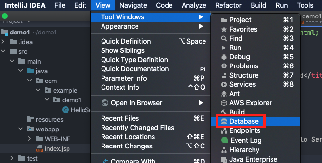
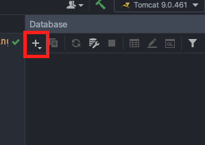
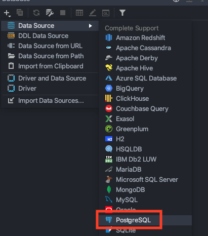
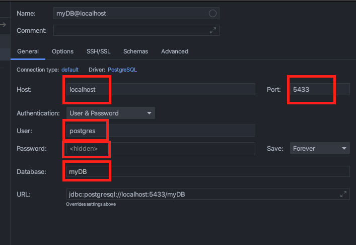
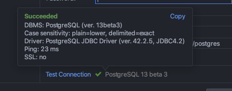
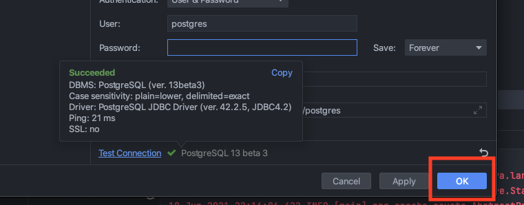
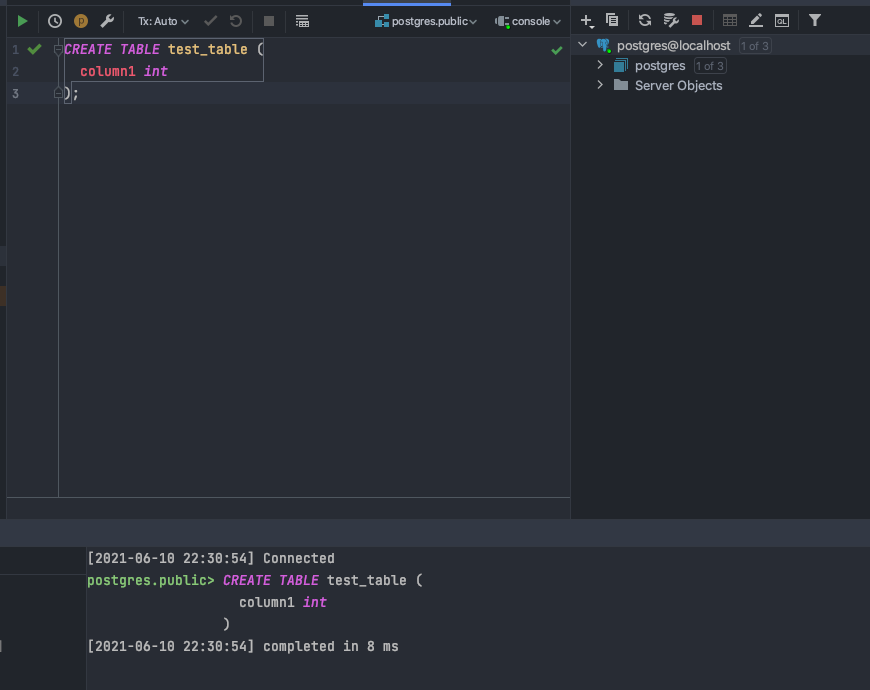
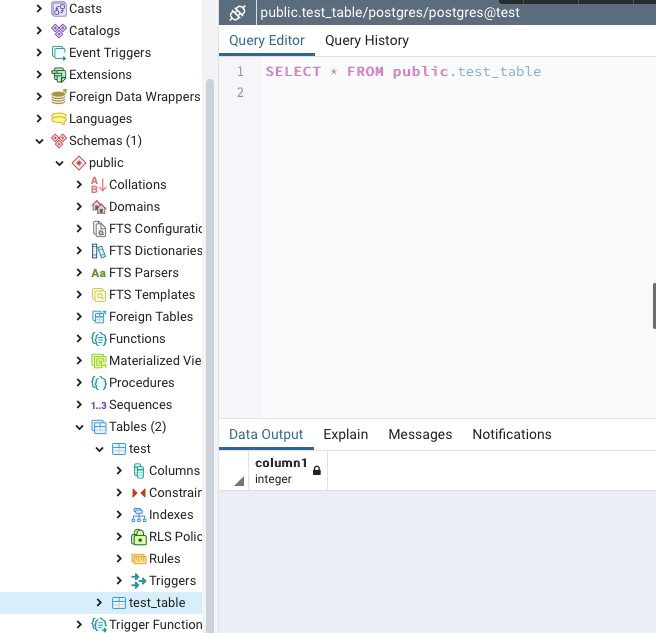

## Step 7: Connect IntelliJ Project to Local PostgreSQL Instance

---

To connect the project to the local instance of PostgreSQL, open the Database view:

Select 'New':

Select 'PostgreSQL':

Enter the details of your local PostgreSQL instance:

Select 'Test Connection' to test the details you entered are correct:

Select 'OK':

The console will open. Run an SQL query to make sure the database has been connected successfully. Enter any query and select 'Run':

If successful, there will be a tick next to the SQL query, and it will display the query in the console:

The newly created table should be viewable in pgAdmin:

---

> The next step is to deploy the application to Heroku. This does not need to be done now - in fact we recommend you 
> begin developing the application prior to deployment.
> However, if you wish to proceed now please proceed to [Step 8: Deploy Project to Heroku](8_heroku_deploy.md).
